# 📱 MIT App Inventor — Experimentos


Repositório com projetos desenvolvidos no **MIT App Inventor** para Android. Todos os apps foram criados do zero, sem uso de IA — com o objetivo de treinar lógica de programação visual com blocos.

---

## 📋 Índice

- [Sobre o Repositório](#-sobre-o-repositório)
- [Estrutura do Repositório](#-estrutura-do-repositório)
- [01 — Player Tauz](#-01--player-tauz)
- [02 — Paint](#-02--paint)
- [03 — Quiz Matemática](#-03--quiz-matemática)
- [04 — Movendo Objetos](#-04--movendo-objetos-foguete-com-botões)
- [05 — Mate o Mosquito](#-05--mate-o-mosquito)
- [06 — Foguete com Acelerômetro](#-06--foguete-com-acelerômetro)
- [Como Replicar](#-como-replicar)
- [O que Aprendi](#-o-que-aprendi)
- [Autor](#️-autor)

---

## 📱 Sobre o Repositório

Este repositório reúne os primeiros projetos que desenvolvi no MIT App Inventor, cada um criado para aprender e praticar um conceito diferente de programação em blocos — desde players de música e jogos de reflexo até sensores do celular.

**Ferramenta:** MIT App Inventor

**Plataforma:** Android

**Total de projetos:** 6

**Período:** Março a Maio de 2026

---

## 📂 Estrutura do Repositório

```
ExperimentosMIT/
│
├── MateMosquito/
├── MovendoObjetos/
├── MovendoObjetos2/
├── Paint/
├── PlayerTauz/
├── QuizMatematica/
├── assets/
├── LICENSE
└── README.md
```

---

## 🎵 01 — Player Tauz


**Meu primeiro projeto.** Um player de música completo com tema visual inspirado no estilo House, chamado VibeHouse.

### Telas

#### Tela 1 — Entrada

Tela inicial com fundo temático e botão para entrar no player.

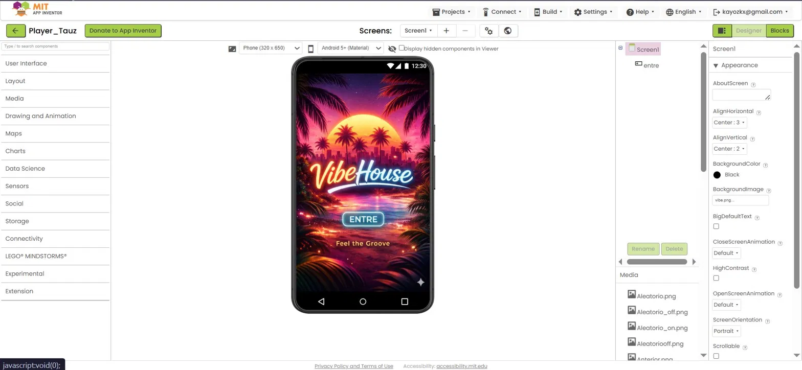

#### Blocos — Tela 1

O botão **ENTRE** abre a Screen2 (player).

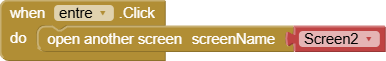

---

#### Tela 2 — Player

Tela principal com controles de reprodução, slider de progresso, botões de próxima e anterior, e exibição da capa da música atual.

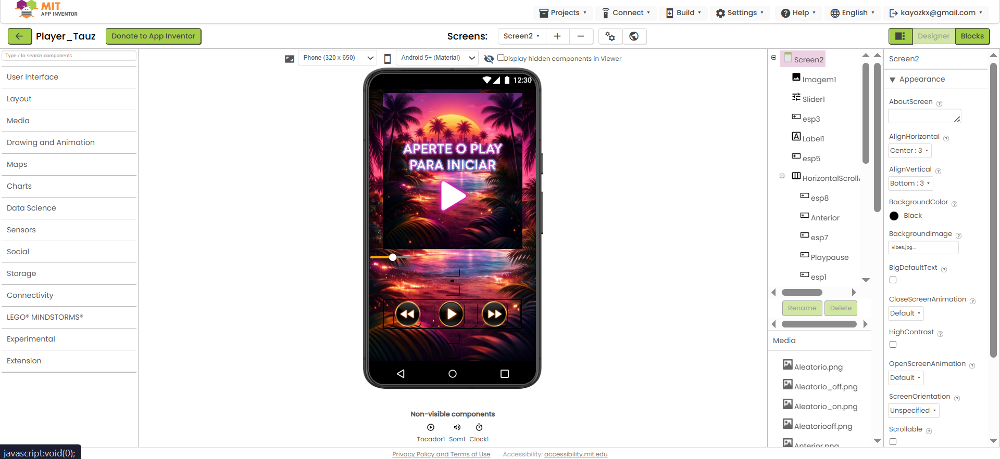

#### Blocos — Tela 2

- **Listas globais:** músicas, nomes das faixas, imagens das capas e durações armazenados em listas
- **chamar_musica:** carrega a faixa atual, atualiza o label com o nome, troca a capa e reseta o slider
- **PlayPause:** alterna entre pausar e continuar; se nenhuma música estiver carregada, chama `chamar_musica`
- **Próximo / Anterior:** incrementa ou decrementa o índice e chama `chamar_musica` com verificação de limites
- **Clock (Timer):** atualiza o slider com o tempo atual da faixa; para automaticamente ao terminar
- **Slider:** quando arrastado, reposiciona a música no ponto selecionado
- **Voltar:** para o tocador e retorna para a Screen1

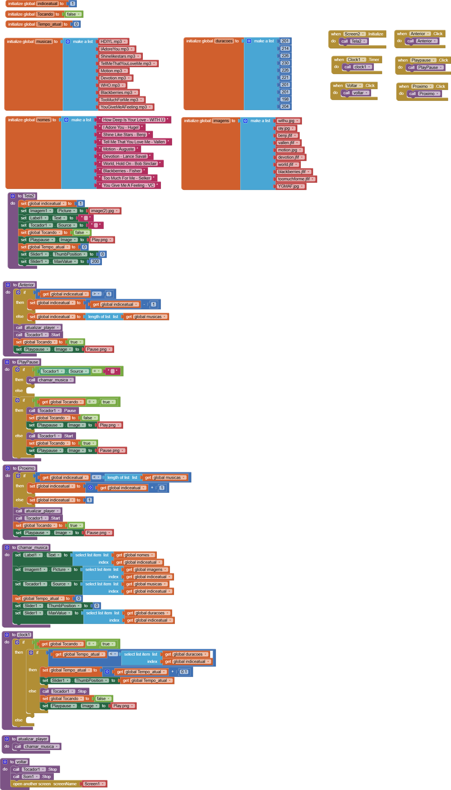

### 📦 Importar o Projeto

```
Projects → Import project (.aia) → PlayerTauz/Player_Tauz.aia
```

> Projeto criado em 30 de março de 2026

---

## 🎨 02 — Paint


App de desenho com canvas livre, paleta de cores e controle de espessura do pincel.

### Tela

Canvas em branco para desenho livre com slider de espessura, botões de cor e botão de limpar.


### Blocos

- **Canvas.Touched:** desenha um ponto nas coordenadas tocadas
- **Canvas.Dragged:** desenha uma linha contínua do ponto anterior ao atual, criando o efeito de pincel
- **Slider.PositionChanged:** atualiza a `LineWidth` do canvas em tempo real
- **Botões de cor:** cada botão define o `PaintColor` do canvas com sua cor correspondente
- **Borracha:** define a cor como branco, simulando apagar
- **Limpar:** chama `Canvas.Clear` para resetar o desenho


### 📦 Importar o Projeto

```
Projects → Import project (.aia) → Paint/Paint.aia
```

> Projeto criado em 04 de abril de 2026

---

## ➕ 03 — Quiz Matemática


Quiz de operações matemáticas com geração aleatória de contas e sistema de pontuação.

### Tela

Interface com a operação exibida (ex: `1 + 1 =`), campo de resposta, placar no topo e botão Responder.

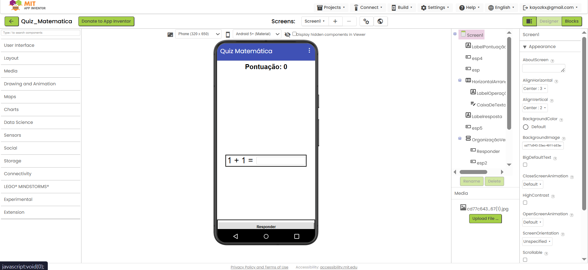

### Blocos

- **Variáveis globais:** `ValorX`, `ValorY`, `Sinal`, `Resultado`, `Pontuação` e `ListaSinais` (`+`, `-`, `x`)
- **inicializarOperações:** sorteia dois números (1–10), escolhe um sinal aleatório e calcula o resultado. Para subtração, garante que o resultado nunca seja negativo
- **Responder.Click:** compara a resposta digitada com o resultado correto; se acertar soma 10 pontos e exibe feedback verde; se errar subtrai 10 pontos e exibe feedback vermelho
- **Próxima.Click:** limpa o campo e chama `inicializarOperações` para nova rodada
- **Pular.Click:** subtrai 10 pontos e avança sem exigir resposta

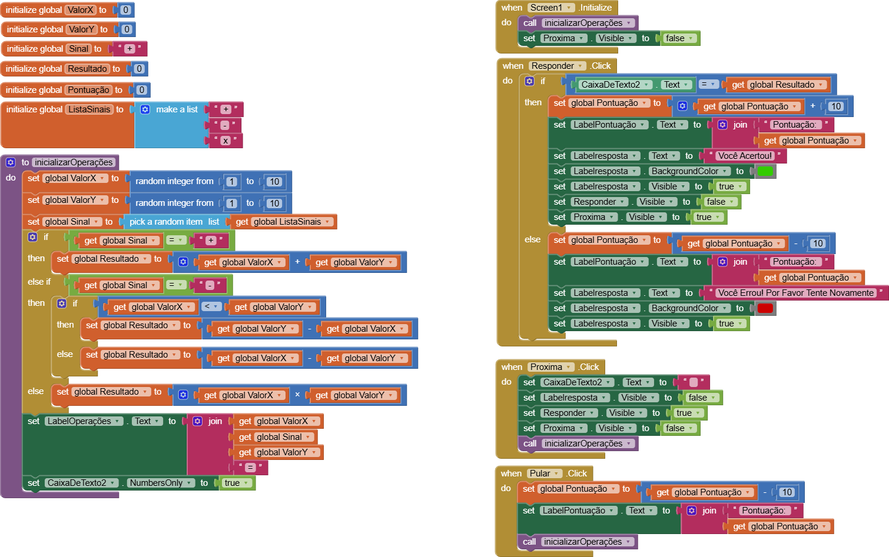

### 📦 Importar o Projeto

```
Projects → Import project (.aia) → QuizMatematica/Quiz_Matematica.aia
```

> Projeto criado em 04 de maio de 2026

---

## 🚀 04 — Movendo Objetos (Foguete com Botões)

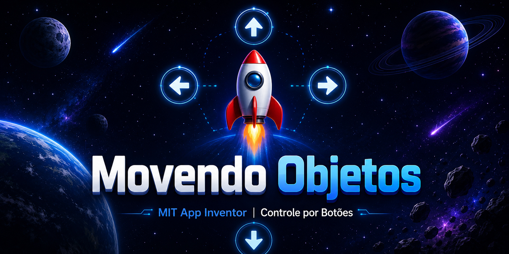

Foguete controlado por botões direcionais na tela. O sprite muda de imagem conforme a direção do movimento.

### Tela

Fundo espacial com um foguete no centro e quatro botões de seta na parte inferior.

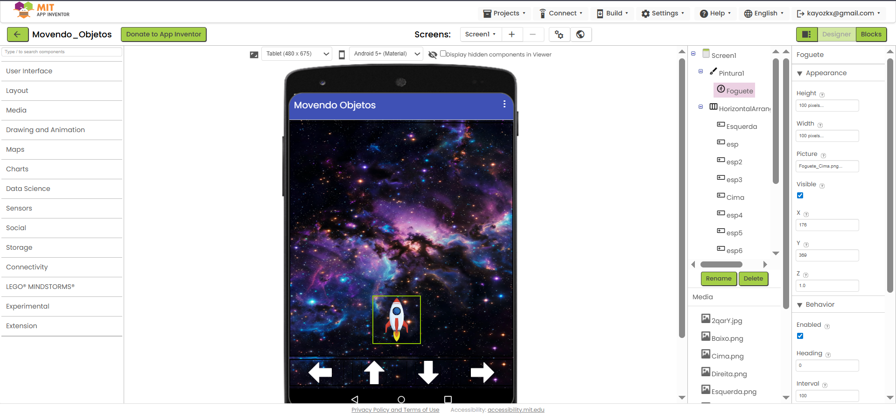

### Blocos

- **alterarsprite (velocidade, direcao):** função reutilizável que define a velocidade e o heading do sprite
- **Botão Esquerda:** muda a imagem e chama `alterarsprite` com direção 180°
- **Botão Direita:** muda a imagem e chama `alterarsprite` com direção 0°
- **Botão Cima:** muda a imagem e chama `alterarsprite` com direção 90°
- **Botão Baixo:** muda a imagem e chama `alterarsprite` com direção 270°
- **Foguete.Dragged:** permite arrastar o sprite diretamente com o dedo

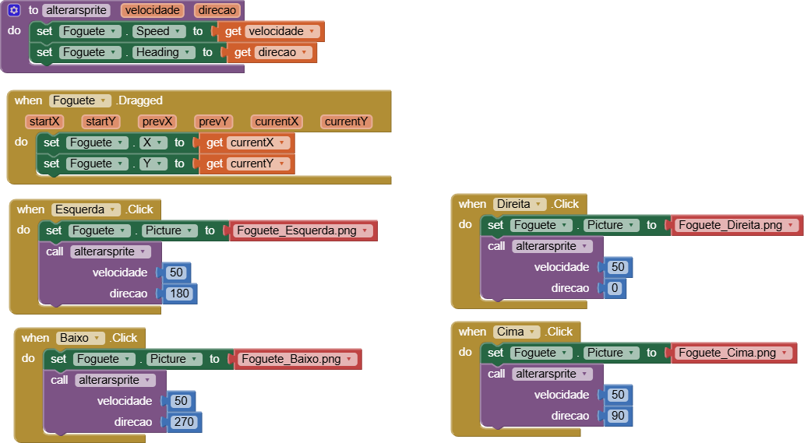

### 📦 Importar o Projeto

```
Projects → Import project (.aia) → MovendoObjetos/Movendo_Objetos.aia
```

> Projeto criado em 07 de maio de 2026

---

## 🦟 05 — Mate o Mosquito


Jogo de reflexo onde um mosquito se move aleatoriamente pela tela e o jogador deve tocá-lo antes que o tempo acabe.

### Tela

Canvas com fundo de sala de estar, contador de tempo (10s) e vidas (3) no topo, e botão Iniciar.

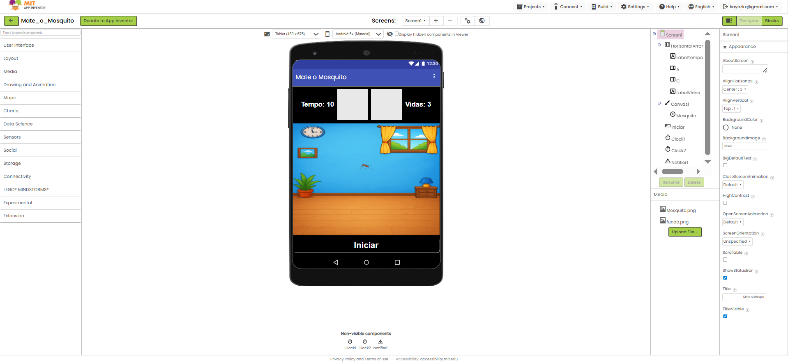

### Blocos

- **Variáveis globais:** `vida` (começa com 3), `tempo` (começa com 10), `jogando` (booleano)
- **MoverMosquito:** posiciona o sprite em coordenadas X e Y aleatórias (0–270)
- **Iniciar.Click:** ativa os clocks, reseta o tempo e chama `MoverMosquito`
- **Clock1.Timer:** decrementa o tempo a cada tick; ao chegar a zero subtrai uma vida. Se não há mais vidas, chama `FimdeJogo`
- **Clock2.Timer:** chama `MoverMosquito` em loop para movimentar o mosquito continuamente
- **Mosquito.Touched:** quando tocado, chama `FimdeJogo`
- **FimdeJogo:** para tudo e exibe dialog com opção de jogar novamente

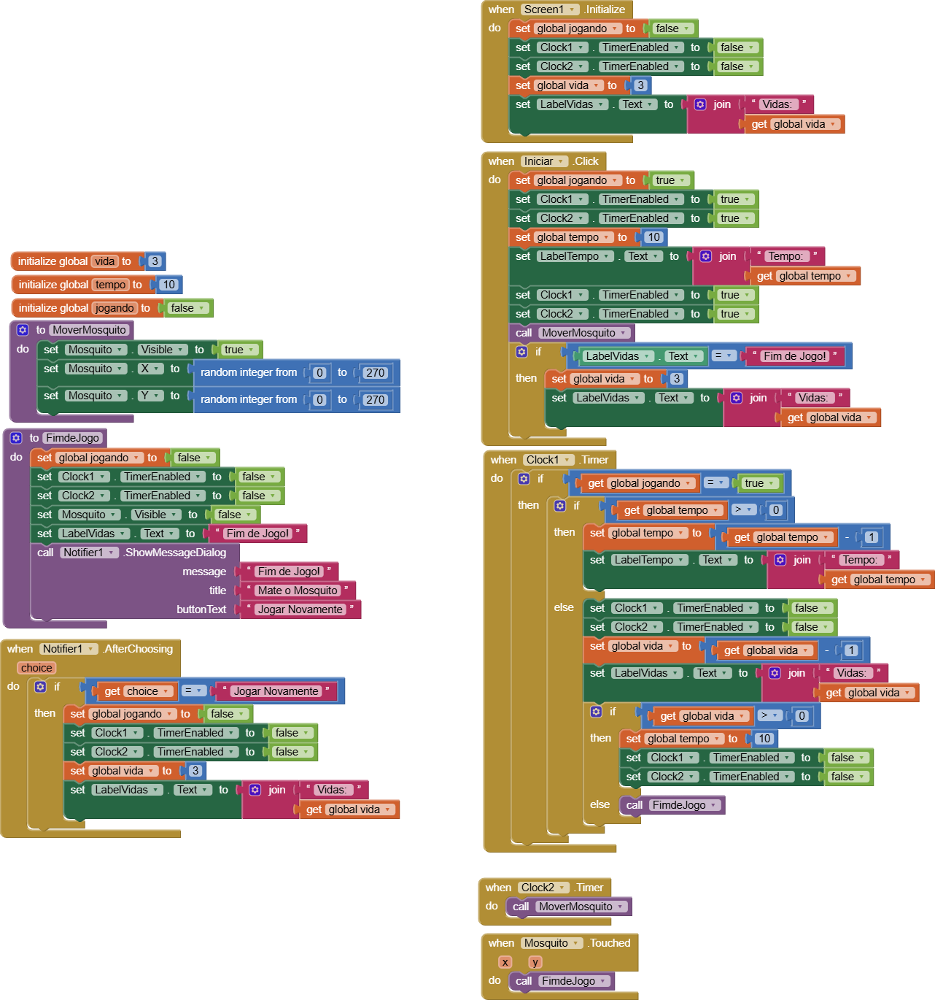

### 📦 Importar o Projeto

```
Projects → Import project (.aia) → MateMosquito/Mate_o_Mosquito.aia
```

> Projeto criado em 11 de maio de 2026

---

## 🚀 06 — Foguete com Acelerômetro

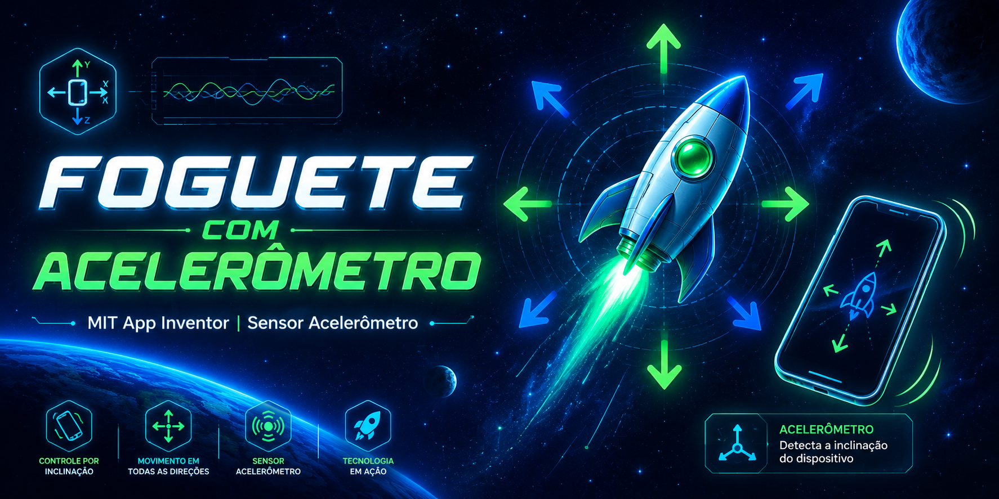

Foguete controlado pela inclinação física do celular usando o sensor acelerômetro.

### Tela

Canvas com foguete sprite e labels mostrando os valores X, Y e Z do acelerômetro em tempo real. Botões Iniciar e Parar.

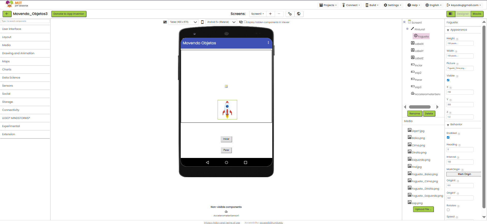

### Blocos

- **alterarsprite (velocidade, direcao):** define velocidade e heading do sprite
- **AccelerometerSensor1.AccelerationChanged:** move o foguete conforme a inclinação do celular:
  - `xAccel ≥ 0` → move para direita
  - `xAccel < 0` → move para esquerda
  - `yAccel ≥ 0` → move para baixo
  - `yAccel < 0` → move para cima
- **Iniciar.Click:** ativa o movimento
- **Parar.Click:** para o movimento e retorna o foguete à posição central

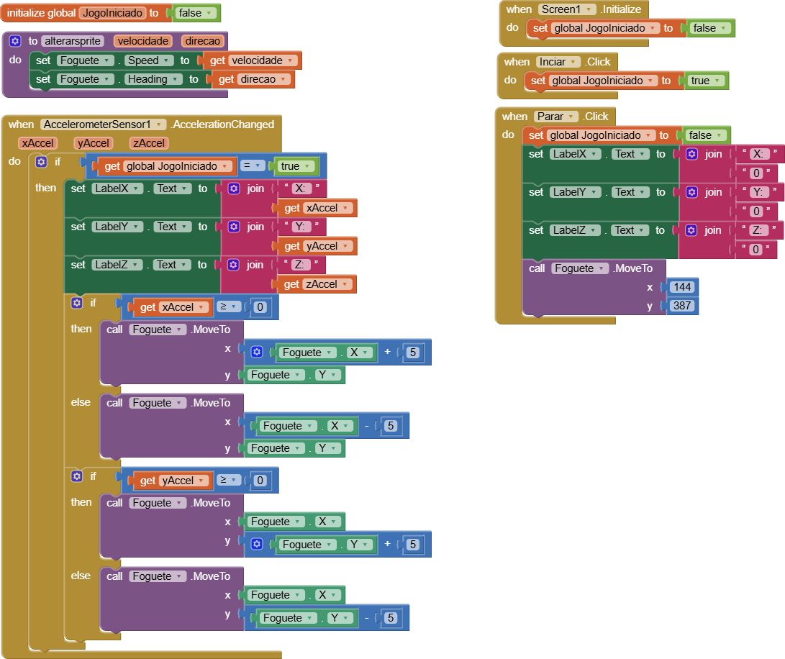

### 📦 Importar o Projeto

```
Projects → Import project (.aia) → MovendoObjetos2/Movendo_Objetos2.aia
```

> Projeto criado em 25 de maio de 2026

---

## 🔁 Como Replicar

1. Acesse [MIT App Inventor](https://appinventor.mit.edu)
2. Vá em **Projects → Import project (.aia) from my computer**
3. Selecione o arquivo `.aia` da pasta do projeto desejado
4. Explore as telas e blocos diretamente no editor

---

## 📚 O que Aprendi

- Lógica de programação visual com blocos no MIT App Inventor
- Uso de listas globais para armazenar e navegar entre dados
- Criação de funções reutilizáveis para simplificar os blocos
- Manipulação de canvas para desenho e jogos
- Uso de Clock para timers e animações
- Integração com sensores do celular como o acelerômetro
- Estruturação e documentação de múltiplos projetos em um repositório

---

## ✏️ Autor

Desenvolvido por **Kayozkx**

Todos os projetos foram feitos do zero, sem uso de IA — apenas lógica própria e programação em blocos.

---

> Este repositório documenta a estrutura e lógica de cada app para fins de aprendizado e portfólio pessoal.
